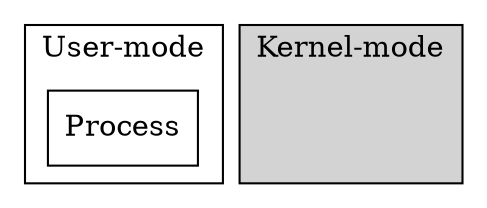
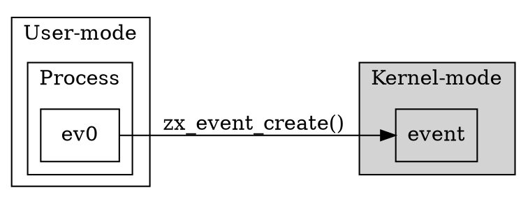
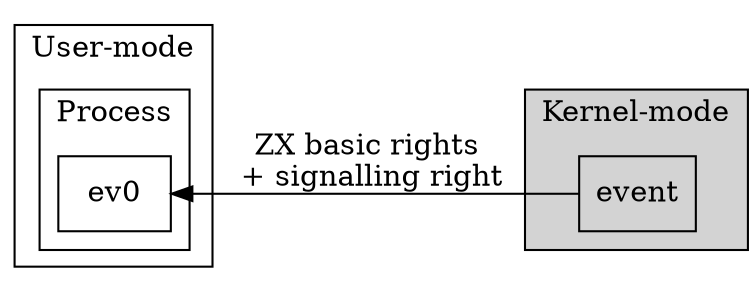
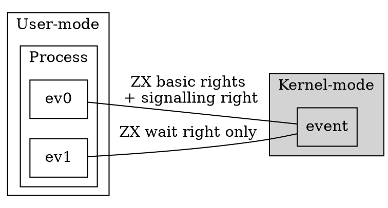

 
# Zircon Handles  锆石手柄 

[TOC]  [目录]

 
## Basics  基本Handles are kernel constructs that allows user-mode programs to reference a kernel object. A handle can be thought as a sessionor connection to a particular kernel object. 句柄是允许用户模式程序引用内核对象的内核构造。可以将句柄视为到特定内核对象的会话或连接。

It is often the case that multiple processes concurrently access the same object via different handles. However, a single handlecan only be either bound to a single process or be bound tokernel. 通常，多个进程通过不同的句柄并发访问同一对象。但是，单个句柄只能绑定到单个进程或绑定到内核。

When it is bound to kernel we say it's 'in-transit'.  当它绑定到内核时，我们说它是“传输中”。

In user-mode a handle is simply a specific number returned by some syscall. Only handles that are not in-transit are visibleto user-mode. 在用户模式下，句柄只是一些系统调用返回的特定数字。用户模式只能看到不在运输途中的手柄。

The integer that represents a handle is only meaningful for that process. The same number in another process might not map to anyhandle or it might map to a handle pointing to a completelydifferent kernel object. 表示句柄的整数仅对该过程有意义。在另一个进程中，相同的数字可能不会映射到任何句柄，或者可能映射到指向完全不同的内核对象的句柄。

The integer value for a handle is any 32-bit number except the value corresponding to **ZX_HANDLE_INVALID** which will always have thevalue of 0.  In addition to this, the integer value of a valid handlewill always have two least significant bits of the handle set.  Themask representing these bits may be accessed using**ZX_HANDLE_FIXED_BITS_MASK** 句柄的整数值是任何32位数字，除了与** ZX_HANDLE_INVALID **对应的值（其值始终为0）之外。有效句柄的整数值将始终具有两个最低有效位。手柄套。可以使用** ZX_HANDLE_FIXED_BITS_MASK **访问表示这些位的掩码

For kernel-mode, a handle is a C++ object that contains three logical fields: 对于内核模式，句柄是包含三个逻辑字段的C ++对象：

 
+ A reference to a kernel object  +对内核对象的引用
+ The rights to the kernel object  +内核对象的权限
+ The process it is bound to (or if it's bound to kernel)  +绑定到的进程（或者如果绑定到内核）

The '[rights](/docs/concepts/kernel/rights.md)' specify what operations on the kernel object are allowed. It is possible for a single process to have two differenthandles to the same kernel object with different rights. “ [权限]（/ docs / concepts / kernel / rights.md）”指定了允许对内核对象执行的操作。单个进程可能对具有不同权限的同一内核对象具有两个不同的句柄。

  ！[用户模式与内核模式]（图像/句柄创建1.png）

**Figure 1.** A user process starts the creation of a handle.  **图1。**用户进程开始创建句柄。

<!--- handle-creation1.png  <！--- handle-creation1.png

 

-->  ->

  ！[用户进程创建内核对象]（images / handle-creation2.png）

**Figure 2.** The user process creates the kernel object (for example, an event) with a system call and holds an integer reference to the object. **图2。**用户进程通过系统调用创建内核对象（例如，事件），并保存对该对象的整数引用。

<!--- handle-creation2.png  <！--- handle-creation2.png

 

-->  ->

  ！[使用一组基本权限创建句柄]（images / handle-creation3.png）

**Figure 3.** Handles are created with a set of basic rights and any additional rights applicable to the kernel object type. **图3。**创建具有一组基本权限和适用于内核对象类型的任何其他权限的句柄。

<!--- handle-creation3.png  <！--- handle-creation3.png

 

-->  ->

  ！[句柄可以重复]（images / handle-creation4.png）

**Figure 4.** Handles can be duplicated. Rights can be dropped during this process. **图4。**手柄可以复制。在此过程中可以放弃权利。

<!--- handle-creation4.png  <！--- handle-creation4.png

 

-->  ->

 
## Using Handles  使用手柄There are many syscalls that create a new kernel object and which return a handle to it. To name a few: 有许多创建新内核对象并返回其句柄的系统调用。仅举几例：
+ [`zx_event_create()`](/docs/reference/syscalls/event_create.md)  + [`zx_event_create（）`]（/ docs / reference / syscalls / event_create.md）
+ [`zx_process_create()`](/docs/reference/syscalls/process_create.md)  + [`zx_process_create（）`]（/ docs / reference / syscalls / process_create.md）
+ [`zx_thread_create()`](/docs/reference/syscalls/thread_create.md)  + [`zx_thread_create（）`]（/ docs / reference / syscalls / thread_create.md）

These calls create both the kernel object and the first handle pointing to it. The handle is bound to the process thatissued the syscall and the rights are the default rights forthat type of kernel object. 这些调用将创建内核对象和指向该对象的第一个句柄。该句柄绑定到发出syscall的进程，并且权限是该类型内核对象的默认权限。

There is only one syscall that can make a copy of a handle, which points to the same kernel object and is bound to the sameprocess that issued the syscall: 只有一个syscall可以复制一个句柄，该句柄指向同一内核对象，并绑定到发出syscall的同一进程：
+ [`zx_handle_duplicate()`](/docs/reference/syscalls/handle_duplicate.md)  + [`zx_handle_duplicate（）`]（/ docs / reference / syscalls / handle_duplicate.md）

There is one syscall that creates an equivalent handle (possibly with fewer rights), invalidating the original handle: 有一个系统调用创建一个等效的句柄（可能具有较少的权限），从而使原始句柄无效：
+ [`zx_handle_replace()`](/docs/reference/syscalls/handle_replace.md)  + [`zx_handle_replace（）`]（/ docs / reference / syscalls / handle_replace.md）

There is one syscall that just destroys a handle:  有一个系统调用只会破坏一个句柄：
+ [`zx_handle_close()`](/docs/reference/syscalls/handle_close.md)  + [`zx_handle_close（）`]（/ docs / reference / syscalls / handle_close.md）

There is one syscall that takes a handle bound to the calling process and binds it into kernel (puts the handle in-transit): 有一个系统调用采用绑定到调用进程的句柄并将其绑定到内核（将句柄放入传输中）：
+ [`zx_channel_write()`](/docs/reference/syscalls/channel_write.md)  + [`zx_channel_write（）`]（/ docs / reference / syscalls / channel_write.md）

There are two syscalls that take an in-transit handle and bind it to the calling process: 有两个系统调用采用传递中的句柄并将其绑定到调用进程：
+ [`zx_channel_read()`](/docs/reference/syscalls/channel_read.md)  + [`zx_channel_read（）`]（/ docs / reference / syscalls / channel_read.md）
+ [`zx_channel_call()`](/docs/reference/syscalls/channel_call.md)  + [`zx_channel_call（）`]（/ docs / reference / syscalls / channel_call.md）

The channel and socket syscalls above are used to transfer a handle from one process to another. For example it is possible to connecttwo processes with a channel. To transfer a handle the source processcalls `zx_channel_write` or `zx_channel_call` and then the destinationprocess calls `zx_channel_read` on the same channel. 上面的通道和套接字syscall用于将句柄从一个进程转移到另一个进程。例如，可以将两个进程与一个通道连接。为了转移一个句柄，源进程调用`zx_channel_write`或`zx_channel_call`，然后目标进程在同一通道上调用`zx_channel_read`。

Finally, there is a single syscall that gives a new process its bootstrapping handle, that is, the handle that it can use torequest other handles: 最后，只有一个syscall可以给新进程提供其引导程序句柄，即可以用来请求其他句柄的句柄：
+ [`zx_process_start()`](/docs/reference/syscalls/process_start.md)  + [`zx_process_start（）`]（/ docs / reference / syscalls / process_start.md）

The bootstrapping handle can be of any transferable kernel object but the most reasonable case is that it points to one end of a channelso this initial channel can be used to send further handles into thenew process. 自举句柄可以是任何可转移的内核对象，但最合理的情况是它指向通道的一端，此初始通道可用于将新的句柄发送到新进程中。

 
## Garbage Collection  垃圾收集If a handle is valid, the kernel object it points to is guaranteed to be valid. This is ensured because kernel objects are ref-countedand each handle holds a reference to its kernel object. 如果句柄有效，则它指向的内核对象将被保证是有效的。这可以确保，因为对内核对象进行了引用计数，并且每个句柄都拥有对其内核对象的引用。

The opposite does not hold. When a handle is destroyed it does not mean its object is destroyed. There could be other handles pointingto the object or the kernel itself could be holding a reference tothe kernel object. An example of this is a handle to a thread; thefact that the last handle to a thread is closed it does not mean thatthe thread has been terminated. 相反的情况不成立。当句柄被销毁时，并不意味着其对象被销毁。可能还有其他指向对象的句柄，或者内核本身可能持有对内核对象的引用。一个例子是线程的句柄。线程的最后一个句柄已关闭的事实并不意味着该线程已终止。

When the last reference to a kernel object is released, the kernel object is either destroyed or the kernel marks the object forgarbage collection; the object will be destroyed at a later timewhen the current set of pending operations on it are completed. 当释放对内核对象的最后一个引用时，内核对象将被销毁或内核将对象标记为垃圾回收。当对象上的当前挂起操作完成时，该对象将在以后的时间被销毁。

 
## Special Cases  特别案例 
+ When a handle is in-transit and the channel or socket it was written to is destroyed, the handle is closed. +当句柄处于传输状态并且销毁了写入它的通道或套接字时，该句柄被关闭。
+ Debugging sessions (and debuggers) might have special syscalls to get access to handles. +调试会话（和调试器）可能具有特殊的syscall来获取对句柄的访问。

 
## Invalid Handles and handle reuse  无效的句柄和句柄重用 

It is an error to pass to any syscall except for `zx_object_get_info` the following values: 传递给除`zx_object_get_info`以下值之外的任何系统调用都是错误的：

 
+ A handle value that corresponds to a closed handle  +与闭合手柄对应的手柄值
+ The **ZX_HANDLE_INVALID** value, except for `zx_handle_close` syscall  + ** ZX_HANDLE_INVALID **值，除了`zx_handle_close`系统调用

The kernel is free to re-use the integer values of closed handles for newly created objects. Therefore, it is important to make sure that properhandle hygiene is observed: 内核可以自由地为新创建的对象重新使用闭合句柄的整数值。因此，重要的是要确保遵守正确的操作卫生规定：

 
+ Don't have one thread close a given handle and another thread use the same handle in a racy way. Even if the second thread is also closing it. +没有一个线程关闭给定的句柄，而另一个线程以一种简洁的方式使用相同的句柄。即使第二个线程也在关闭它。
+ Don't ignore **ZX_ERR_BAD_HANDLE** return codes. They usually mean the code has a logic error. +不要忽略** ZX_ERR_BAD_HANDLE **返回代码。它们通常表示代码有逻辑错误。

Detecting invalid handle usage can be automated by using the **ZX_POL_BAD_HANDLE** Job policy with **ZX_POL_ACTION_EXCEPTION** togenerate an exception when a process under such job object attempts any ofthe of the mentioned invalid cases. 可以通过将** ZX_POL_BAD_HANDLE作业策略与** ZX_POL_ACTION_EXCEPTION **配合使用来自动检测无效的句柄用法，以在此类作业对象下的进程尝试任何上述无效情况时生成异常。

 
## See Also  也可以看看